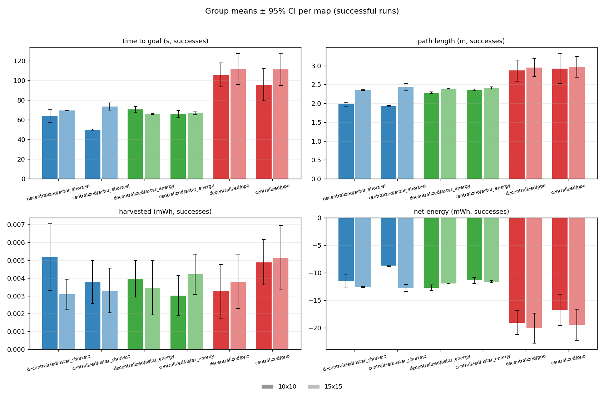

# Energy-Harvesting-Aware Path Planning on a TurtleBot3

> A physical-robot testbed comparing a learned **PPO** policy against an energy-aware **A\*** planner
> for energy-harvesting-aware path planning — the real-world hardware validation of a simulation
> study, built during an internship at **imec**.


A single TurtleBot3 Burger drives across a grid on the floor. An overhead camera tracks it from ArUco
markers; each step a planner is asked — given an obstacle map and a live, light-derived **energy
map** — which of 8 directions to take, and the robot drives one cell. Every run is recorded and
analysed to compare planners on success rate, path efficiency, and net energy.

The experiment is a **2×3**: **compute placement** (decentralized on the robot vs centralized on a
desktop) × **planner** (learned **PPO** vs energy-aware **A\*** vs shortest-path **A\***).

## Highlights

- 🤖 Real TurtleBot3 Burger, ROS 2 Humble — closed-loop, one grid cell per step.
- 🔋 On-board energy instrumentation: 3× INA219 (solar harvest + compute + motor rails) and Intel
  RAPL for compute energy.
- 🧠 Runs the original study's trained **PPO** policy (via ONNX) alongside a drop-in energy-aware **A\***
  baseline behind one swappable service.
- 📷 Overhead ArUco localization + an experiment **orchestrator** that automates whole campaigns
  (SSH bag recording, warmup, timed runs, pull-back, metadata).
- 📊 ROS-free analysis pipeline → figures and summary metrics from recorded `.mcap` + JSONL.

## Results
More results can be found in the associated report. 


## Repository layout

| Directory | What it is |
|---|---|
| [`robot/`](robot/) | ROS 2 (Humble) workspace — planners, grid navigation, sensors, TCP bridge. |
| [`tracker/`](tracker/) | Overhead-camera ArUco localization + the experiment orchestrator. |
| [`analysis/`](analysis/) | Post-run pipeline: recorded runs → figures + summary metrics. |
| [`experiments/`](experiments/) | Campaign definitions, figures, and per-run summaries. |
| [`docs/`](docs/) | Architecture, run guide, hardware, calibration, protocol & conventions. |

## Quickstart

```bash
# Robot (ROS 2 Humble):
cd robot && ./scripts/build_all.sh && source ~/turtlebot3_ws/install/setup.bash
ros2 launch tb3_bringup bringup.launch.py planner:=ppo      # or astar / astar_shortest

# Tracker + orchestrator (laptop):
cd tracker && pip install -r requirements.txt && python main.py
```

The full walkthrough — setup, modes, running a campaign, and analysis — is in
**[docs/running.md](docs/running.md)**. Start with **[docs/architecture.md](docs/architecture.md)**
for the big picture.

## Research context & citation

This testbed is a physical replication / hardware validation of:

> M. Mokhtari, B. Vanderborght, J. Famaey, "Energy harvesting aware path planning for
> ambiently-powered multi-robot systems," *Robotics and Autonomous Systems*, vol. 197 (2026),
> art. 105260. [doi:10.1016/j.robot.2025.105260](https://doi.org/10.1016/j.robot.2025.105260)

The paper evaluates a multi-robot scheme in ROS-Gazebo and lists *real-world hardware validation* as
future work. Scoping notes: the hardware is a **single** robot (the 10-robot PPO policy is run with
the other agents "ghosted"), and "centralized vs decentralized" here refers to **compute placement**,
not the paper's algorithmic centralization. See [docs/architecture.md](docs/architecture.md).

## Acknowledgements

Built during an internship at **imec**. The PPO policy originates from the work of the paper's
authors; thanks to them and to imec for the TurtleBot3 hardware.

## License

[MIT](LICENSE) © 2026 Lars De Leeuw
