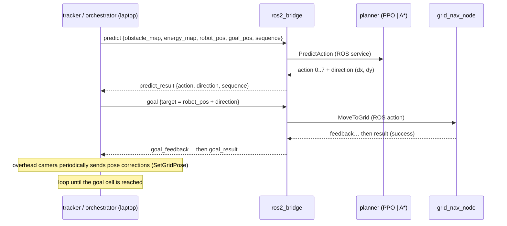

# Architecture

How the three parts of this repo fit together to run an energy-harvesting-aware path-planning
experiment on a real TurtleBot3.

## The experiment in one picture

A single TurtleBot3 Burger drives across a grid laid out on the floor. An overhead camera tracks the
robot from ArUco markers. Each step, a **planner** is asked — given an obstacle map and a live,
light-derived **energy map** — which of 8 directions to move; the robot drives one cell; repeat until
the goal is reached. Every run is recorded and later analysed to compare planners.

The experiment is a **2×3**: **compute placement** (decentralized on the robot vs centralized on a
desktop) × **planner** (learned **PPO** vs energy-aware **A\*** vs shortest-path **A\***).

## Components

| Part | Runs on | Responsibility |
|---|---|---|
| [`tracker/`](../tracker/) | Windows laptop | Overhead ArUco localization → pose corrections + grid goals; builds the energy map; the **orchestrator** automates whole campaigns of runs. |
| [`robot/`](../robot/) | TurtleBot3 (Pi 4B) and/or a desktop | ROS 2 (Humble) stack: planners, closed-loop grid navigation, the TCP bridge, and power/thermal/diagnostics sensing. |
| [`analysis/`](../analysis/) | Any machine (no ROS needed) | Turns recorded runs (`.mcap` + JSONL) into figures and summary metrics. |

## Three-tier topology

```
   ┌──────────────────────────┐         TCP 9090 (newline-JSON)        ┌───────────────────────────┐
   │  Laptop (Windows)        │  ───────────────────────────────────▶ │  Compute host (ROS 2)     │
   │                          │   predict / goal / pose / events       │                           │
   │  tracker + orchestrator  │ ◀───────────────────────────────────  │  ros2_bridge              │
   │  (overhead camera)       │   predict_result / feedback / nav_pose │  ├─ planner (PPO | A*)    │
   │                          │                                        │  ├─ grid_nav (MoveToGrid) │
   │  SSH ───── bag record ───┼──────────────────────────────────────▶│  └─ diagnostics / RAPL    │
   └──────────────────────────┘                                        └───────────────────────────┘
                                                                          decentralized: this is the
                                                                          robot (Pi 4B). centralized:
                                                                          a desktop; the robot then
                                                                          runs only the sensor layer
                                                                          (3× INA219 power + thermal).
```

In **decentralized** mode the whole ROS stack runs on the robot's Pi 4B. In **centralized** mode the
identical stack runs on a desktop while the robot publishes only its sensors — so "centralized vs
decentralized" here means **where the computation runs**, which is the experiment's independent
variable for the compute-energy comparison.

> Cross-host transport is a deliberately simple **newline-delimited JSON over TCP** bridge (port
> 9090), not DDS — cross-host DDS over WiFi/VM bridging proved fragile. DDS stays intra-host. Bag
> recording is started/stopped over SSH and the bags are copied back to the laptop.

## The closed loop (one cell per step)



Both planners expose the **same `PredictAction` service** and return only the *immediate next step*
(A\* computes a full path internally but exposes only the first move). Swapping PPO ↔ A\* is a single
launch argument. The planner is **advisory** — the robot only moves when the orchestrator issues a
`goal`. This is the physical embodiment of the source paper's observe–think–act cycle.

See [bridge-protocol.md](bridge-protocol.md) for the exact wire contract and
[coordinate-conventions.md](coordinate-conventions.md) for the grid/heading/action conventions
(get these wrong and maps come out rotated 90°).

## What gets measured

Each run records distributed `.mcap` bags (per host) plus a `predict_log.jsonl` sidecar:

- **Energy** — 3× INA219 sensors on the robot at 100 Hz: solar (harvest), SBC, and motor rails — the
  physical analog of the paper's simulated energy field. See [hardware.md](hardware.md).
- **Compute energy** — Intel RAPL on the desktop in centralized mode.
- **Timing** — a per-`sequence` decomposition into algorithm inference, bridge plumbing, and TCP, so
  the on-robot inference time can be compared directly against the paper's CPU figure.
- **Outcome** — ground-truth success/failure from the nav node, plus the executed trajectory.

[`analysis/`](../analysis/) joins these offline (no ROS install needed — bags carry their schemas)
into per-run summaries and cross-run figures.

## Research context

This is a **physical replication / hardware validation** of the simulation study:

> M. Mokhtari, B. Vanderborght, J. Famaey, "Energy harvesting aware path planning for
> ambiently-powered multi-robot systems," *Robotics and Autonomous Systems*, vol. 197 (2026),
> art. 105260. [doi:10.1016/j.robot.2025.105260](https://doi.org/10.1016/j.robot.2025.105260)

The paper studies a multi-robot scheme (H-CMARL-DE) in ROS-Gazebo and explicitly lists *real-world
hardware validation* as future work — which is what this testbed provides. Two honest scoping notes:

1. The hardware is a **single** TurtleBot; the PPO policy was trained for 10 robots and is run with
   the other 9 "ghosted" onto the real robot's cell. The multi-robot coordination layer is not
   physically replicated.
2. "Centralized vs decentralized" here means **compute placement** (robot vs desktop), which is
   adjacent to — but distinct from — the paper's algorithmic CTDE-vs-H-CMARL-DE centralization.
